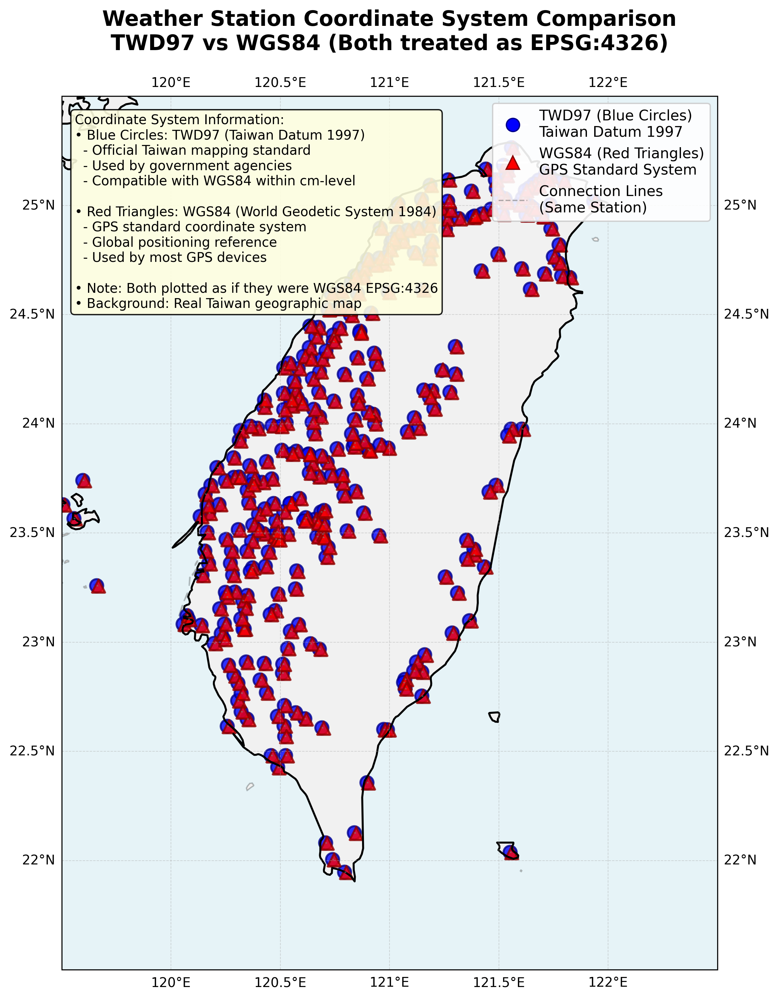
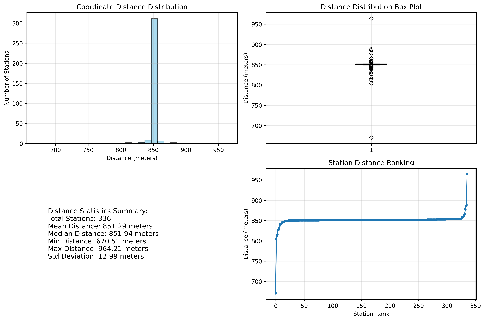

# Spatial Analysis Project - Week 1

## 專案概述
這是一個空間分析專案，主要功能包括：
- 串接中央氣象署 (CWA) 自動氣象站觀測 API
- 獲取全台即時氣象數據
- 使用 Folium 進行地圖視覺化
- 依氣溫進行分色標示
- **坐標系統比較分析 (TWD97 vs WGS84)**

## 🗺️ 坐標系統比較分析 (CRS Compare)

### 分析概覽
本研究分析了中央氣象署API中每個測站的兩組坐標系統，比較TWD97與WGS84之間的差異。

### 📊 主要發現
- **分析測站數量**: 336個氣象站
- **平均坐標偏移**: 851.29公尺
- **偏移範圍**: 670.51 - 964.21公尺
- **標準差**: 12.99公尺 (顯示高度一致性)

### 🎯 坐標系統說明
- **🔵 TWD97 (藍色圓形)**: 台灣官方測量基準，政府機構標準
- **🔺 WGS84 (紅色三角形)**: GPS標準坐標系統，全球定位參考

### 📈 視覺化成果

#### 1. 坐標比較地圖


#### 2. 距離統計分析


#### 3. 詳細數據表格
[查看完整CSV資料](coordinate_comparison_detailed_english.csv)

### 📋 統計摘要
| 指標 | 數值 |
|------|------|
| 總測站數 | 336 |
| 平均距離 | 851.29 公尺 |
| 中位數距離 | 851.94 公尺 |
| 最小距離 | 670.51 公尺 |
| 最大距離 | 964.21 公尺 |
| 標準差 | 12.99 公尺 |

### 🔍 技術分析
- 兩種坐標系統間存在**系統性偏移**
- 偏移量相當**一致**，非隨機誤差
- TWD97與WGS84在台灣地區相差約**850公尺**

## 專案結構
```
exercise2/
├── data/                   # 原始資料目錄
├── outputs/                # 分析結果輸出
│   ├── coordinate_comparison_*.png     # 坐標比較地圖
│   ├── distance_analysis_*.png         # 距離統計分析
│   ├── coordinate_comparison_detailed_*.csv  # 詳細坐標資料
│   ├── weather_stations_*.csv          # 氣象站資料
│   ├── weather_map_*.html              # 氣象地圖
│   └── weather_heatmap_*.html          # 溫度熱力圖
├── scripts/                # 分析腳本
│   ├── crs_compare.py              # 坐標系統比較分析 (中文版)
│   ├── crs_compare_english.py       # 坐標系統比較分析 (英文版)
│   ├── check_coordinate_systems.py  # 坐標系統檢查工具
│   ├── cwa_weather_api.py           # CWA API 串接
│   ├── debug_api.py                 # API 調試工具
│   └── weather_map_visualization.py # 地圖視覺化
├── .env                    # API 金鑰設定
├── .gitignore              # Git 忽略檔案
├── requirements.txt        # Python 套件依賴
└── README.md              # 專案說明文件
```

## 安裝與設定

### 1. 安裝依賴套件
```bash
pip install -r requirements.txt
```

### 2. 設定 API 金鑰
在 `.env` 檔案中加入您的中央氣象署 API 金鑰：
```
CWA_API_KEY=your_cwa_api_key_here
```

### 3. 執行腳本

#### 獲取氣象資料
```bash
python scripts/cwa_weather_api.py
```

#### 生成地圖視覺化
```bash
python scripts/weather_map_visualization.py
```

## 功能特色

### CWA API 串接
- 獲取全台 336+ 個自動氣象站即時資料
- 包含溫度、濕度、氣壓、風速、風向等數據
- 自動儲存為 CSV 格式

### 地圖視覺化
- **氣象地圖**：依氣溫分色標示測站位置
  - 🔵 藍色：氣溫 < 20°C
  - 🟢 綠色：20°C ≤ 氣溫 ≤ 28°C
  - 🟠 橘色：氣溫 > 28°C
- **溫度熱力圖**：顯示溫度分佈密度
- 點擊測站顯示詳細資訊彈窗

### 資料統計
- 氣溫分佈統計
- 最高/最低溫測站資訊
- 全台平均溫度計算

## 技術棧
- **Python 3.10+**
- **Requests** - HTTP 請求處理
- **Pandas** - 資料處理與分析
- **Folium** - 互動式地圖視覺化
- **python-dotenv** - 環境變數管理

## API 資料來源
- 中央氣象署開放資料平台
- API: O-A0003-001 (自動氣象站觀測資料)
- 更新頻率：每小時

## 輸出檔案
- `weather_stations_*.csv` - 完整測站資料
- `weather_map_*.html` - 互動式氣象地圖
- `weather_heatmap_*.html` - 溫度熱力圖

## 注意事項
- 請確保 `.env` 檔案中的 API 金鑰正確設定
- 地圖檔案可在瀏覽器中直接開啟查看
- 建議定期更新氣象資料以獲取最新資訊

## 授權
MIT License
